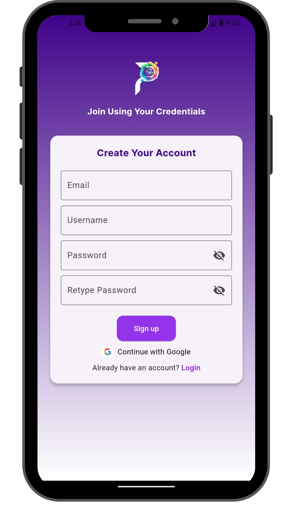
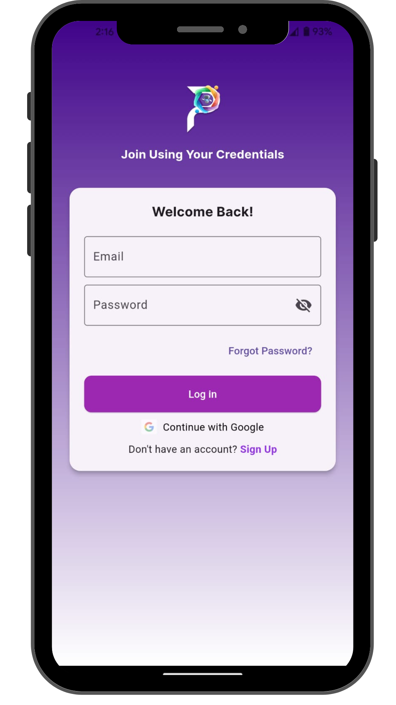
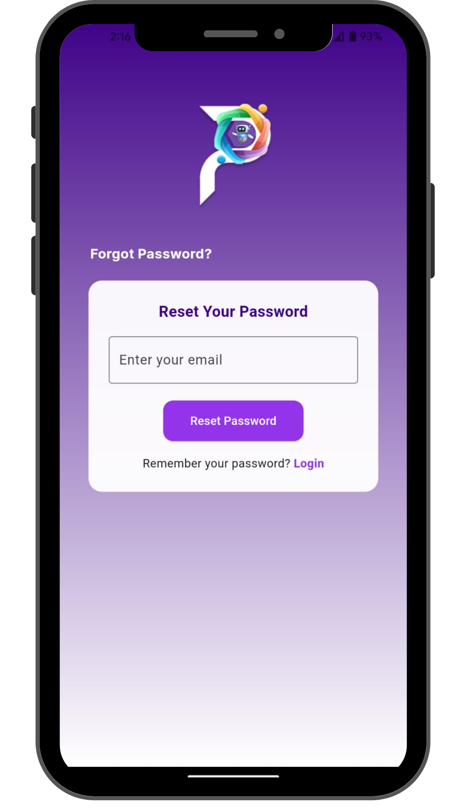
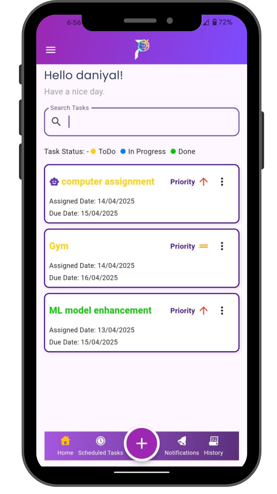
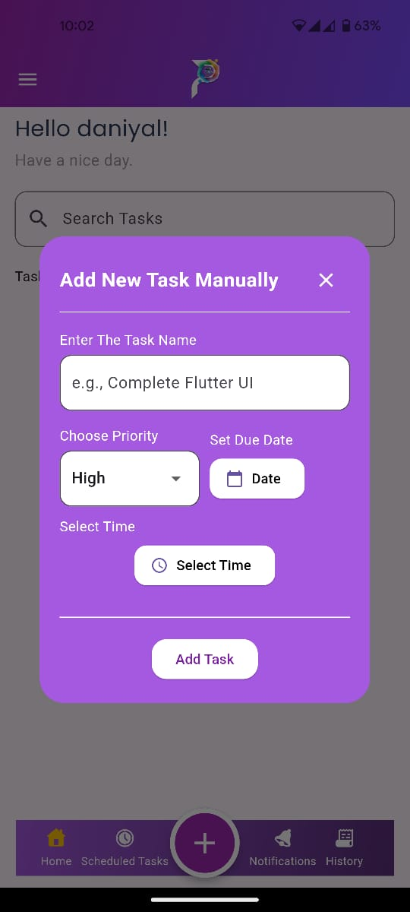
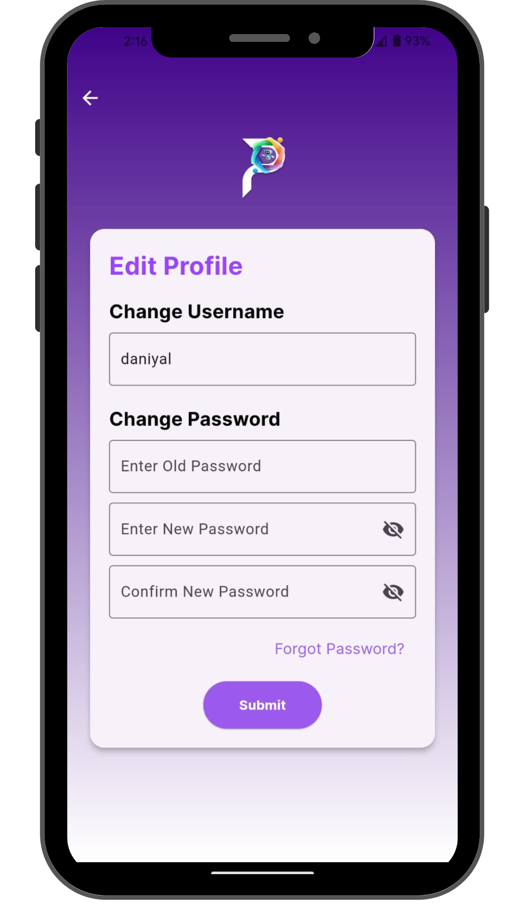
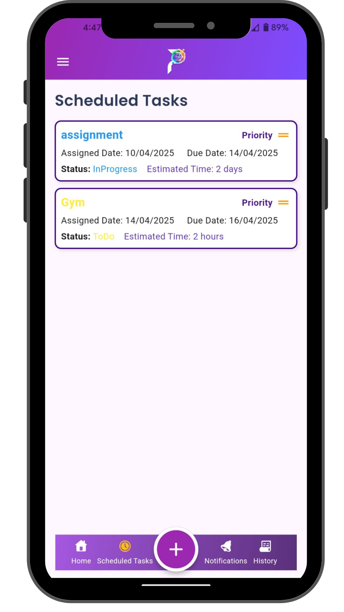
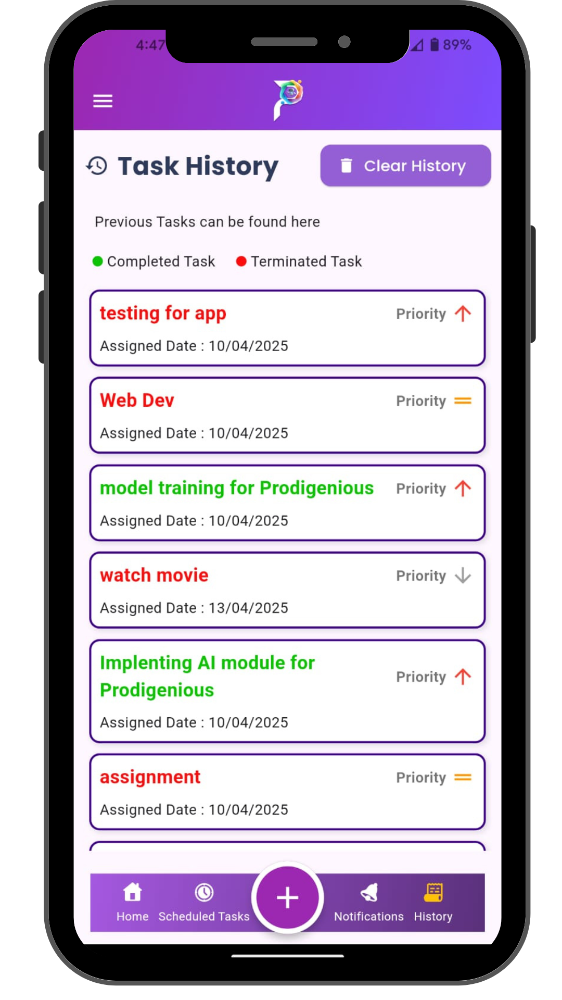
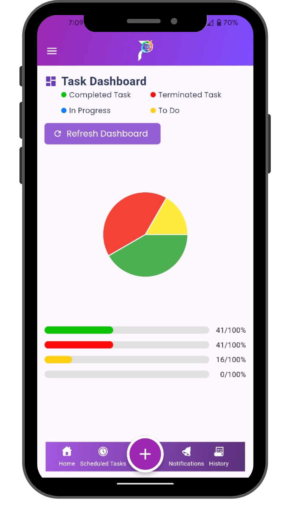
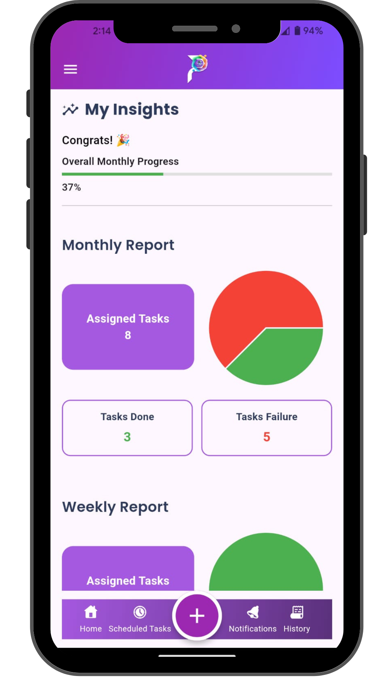

# 🧠 Prodigenius – AI-Powered Task Management App

Prodigenius is a Flutter-based task management mobile app powered by AI. It helps users organize, prioritize, and schedule their daily tasks with smart recommendations and reminders – all done using free, on-device machine learning tools like Firebase ML Kit and TensorFlow Lite.

---

## 🚀 Features

- ✍️ **Manual Task Input & Categorization**
  - Add tasks manually and categorize them (Work, Study, Personal, etc.)
- ⚙️ **Task Prioritization**
  - Prioritize tasks based on urgency and deadlines
- ⏳ **Estimated Task Duration**
  - Uses TensorFlow Lite to predict how long tasks will take
- 📅 **Scheduling**
  - Suggests best time slots for tasks based on user availability
- 🔔 **Smart Notifications**
  - Reminders for upcoming or high-priority tasks using local notifications
- 📈 **Productivity Tracking**
  - Simple insights like “You’re most productive on Wednesdays”
- 📊 **Dashboard & Visualizations**
  - Track your progress with clean visual charts

---

## 🛠 Tech Stack

- **Flutter** – Cross-platform mobile framework
- **TensorFlow Lite** – Pre-trained AI models for task duration estimation
- **tflite_flutter Plugin** – For integrating TFLite with Flutter
- **Flutter Local Notifications** – For task reminders

---

## 📸 Screenshots

  
  
  

  
  
  

  
  
  

  
  

---

## 📚 Tools & Resources

- Flutter SDK – [Install Guide](https://flutter.dev/docs/get-started/install)
- Android Studio / Visual Studio Code
- Firebase Tools – [ML Kit](https://firebase.google.com/products/ml-kit)
- TensorFlow Lite – [Model Maker](https://www.tensorflow.org/lite/guide/model_maker)
- tflite_flutter Plugin – [Plugin Page](https://pub.dev/packages/tflite_flutter)
- Flutter Local Notifications – [Plugin Page](https://pub.dev/packages/flutter_local_notifications)
- Dart DevTools – [DevTools](https://dart.dev/tools/dart-devtools)

